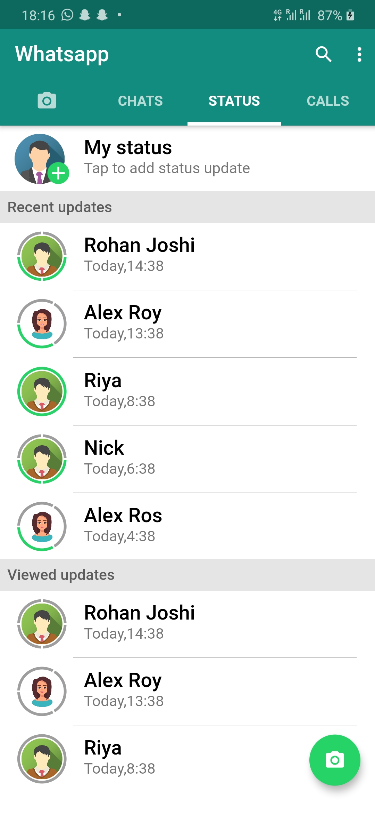
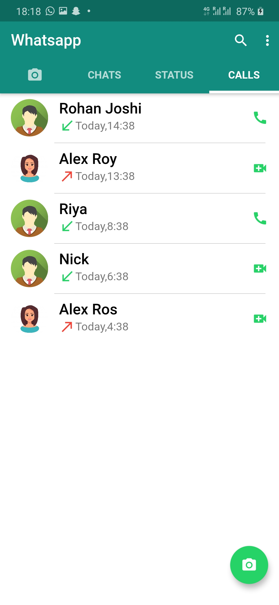

# whatsaap ui clone in flutter framework


  - chat list
  - chat
  - status

# New Features!

  - status screen with story view and indicators
  - call

# Scrrenshot
<table>
  <tr>
    <td>Chat List</td>

  </tr>
  <tr>
    <td></td>
   <td></td>

 

  </tr>
 </table>
 <table>
  <tr>
    <td>Status & Call</td>

  </tr>
  <tr>
    <td></td>
  <td></td>

  </tr>
 </table>

### Installation

 requires [Flutter](https://flutter.dev/)  to run.

Install the dependencies and devDependencies and run app.

```sh
$ git  clone https://github.com/hyperonetech/whatsapp_ui_clone.git
$ cd whtasapp_ui_clone
$ flutter pub get
$ flutter run
```


### Plugins

App is currently extended with the following plugins. Instructions on how to use them in your own application are linked below.

| Plugin | README |
| ------ | ------ |
| Story View | [https://pub.dev/packages/story_view] |
| Cached Network image | [https://pub.dev/packages/cached_network_image] |
| fl_chart | [https://pub.dev/packages/fl_chart] | 


### Development

Want to contribute? Great!
| Whatsapp | [htttps://wa.me/14582047711] | 
| Email | [hyperonetech@gmail.com] | 
 

License
----

MIT


**Free Software, Hell Yeah!**
 
